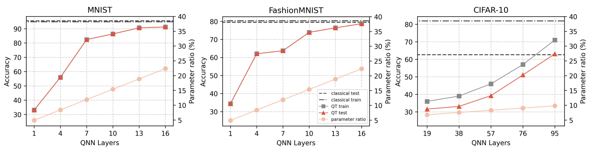
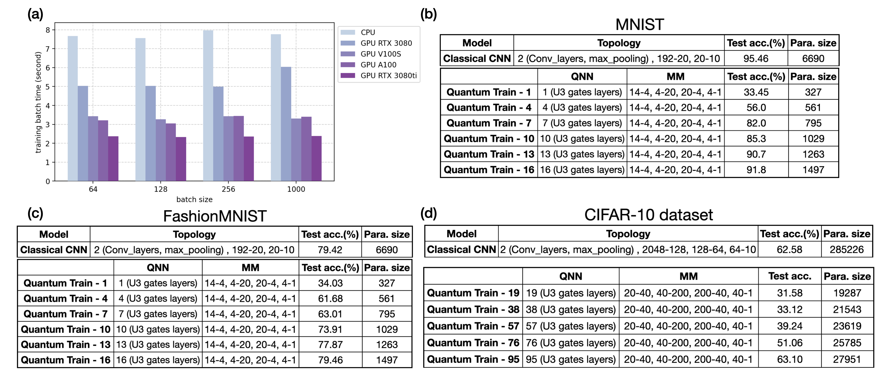

# Quantum-Train Toolkit


### *Reducing the training parameters in Classical ML model by Quantum Machine Learning*

In this project, we propose a new perspective on quantum machine learing (QML) that involves training classical neural networks (NNs) by mapping $M$ classical NN weights into an $\lceil \log_2 M \rceil$-qubit parameterized quantum state with  $2^{\lceil \log_2 M \rceil} \sim M$ amplitudes, called Quantum-Train (QT). Assuming that our parameterized quantum state, or quantum neural network (QNN), has a polynomial number of layers, the action of tuning this QNN with $\text{PolyLog}(M)$ parameters effectively tunes a classical NN with $M$ parameters. 

In practice, more specifically, we need an additional mapping model (which also has  parameters) to map the probability outputs to NN weights. That is, we could train the same classical NN with a PolyLog parameter reduction. As shown in below : 


We provide the examples of using QT on the VGG-like CNN on MNIST dataset, FashionMNIST, and CIFAR-10 dataset.

## Why it is interesting

Besides the PolyLog reduction behavior of the proposed approach, one may also observe that we are tackling three of the main challenges in the QCML domain.

* The data embedding issue is resolved: 
Firstly, since we are essentially generating classical NN weights through a QNN, the input and output of the ML model are entirely classical. As such, we don't have to worry about the data embedding issues associated with QNNs (for example, the need for data-loading QNN layers that impose constraints on input data size or require data compression).

* Inference without quantum computers:
The trained model is compatible with classical hardware. In fact, model inference relies solely on classical computers, enhancing its practicality, especially given the limited availability of quantum computers compared to classical ones. However, it's important to remember that we still benefit from quantum computing for its PolyLog reduction in the training process, which stems from the exponentially large Hilbert space.

* General approach for QCML, QML, and ML:
Although our example in the QHack 2024 is the application to the quantum many-body physics, the proposed approach in Fig. nv. 1 is actually a general training flow for ANY QCML, QML, and ML use case, with PolyLog parameter reduction behavior. In the future, we would also like to tackle larger ML model that the parameter reduction will make the applicability totally different.  

## CUDA Quantum and NVIDIA GPUs. 

We conducted our numerical simulations of QCML primarily using TorchQuantum with NVIDIA GPUs. In fact, we experimented with Qiskit-gpu built with cuQuantum, PennyLane with Lightning.gpu (also built on cuQuantum), and cuTensorNet, and found that TorchQuantum is the most suitable for our project. It's worth noting that we also provide a PennyLane version of the code, although some details may differ. The NVIDIA GPUs we used are the NVIDIA RTX3080 and RTX3080ti with CUDA 11.6.


## On MNIST, FashionMNIST, CIFAR-10 datasets 
The use of NVIDIA GPUs led to a training speedup of up to 3.28X for the QT model proposed in this hackathon project, compared to training with a CPU, as illustrated in (a). This speedup is significant, especially given the extensive volume of training data and the prolonged duration of the training process in certain instances. We present results of the QT approach applied to well-known datasets such as MNIST, FashionMNIST, and CIFAR-10. The codes to generate these result are provided in the `appendix_example` folder. Note that there is a pennylane version of the code for CIFAR-10 dataset, and only torchquantum version for others.






## Installation
```bash
conda create --name tqtest python=3.9
pip Install qiskit==0.45.0 qiskit_ibm_runtime==0.16.0 qiskit-qer==0.13.0
git clone https://github.com/mit-han-lab/torchquantum.git
cd torchquantum
pip install --editable .
```
We use the [TorchQuantum](https://github.com/mit-han-lab/torchquantum/tree/main) as the computational backend of QT.

## Papers using Quantum-Train Toolkit

* [QTRL: Toward Practical Quantum Reinforcement Learning via Quantum-Train](https://arxiv.org/abs/2407.06103)  
***Chen-Yu Liu***, Chu-Hsuan Abraham Lin, Chao-Han Huck Yang, Kuan-Cheng Chen, Min-Hsiu Hsieh  
arXiv preprint, arXiv: 2407.06103 (2024)  

* [Quantum-Train: Rethinking Hybrid Quantum-Classical Machine Learning in the Model Compression Perspective](https://arxiv.org/abs/2405.11304)  
***Chen-Yu Liu***, En-Jui Kuo, Chu-Hsuan Abraham Lin, Jason Gemsun Young, Yeong-Jar Chang, Min-Hsiu Hsieh, Hsi-Sheng Goan  
arXiv preprint, arXiv: 2405.11304 (2024)

* [Training Classical Neural Networks by Quantum Machine Learning](https://arxiv.org/abs/2402.16465)  
***Chen-Yu Liu***, En-Jui Kuo, Chu-Hsuan Abraham Lin, Sean Chen, Jason Gemsun Young, Yeong-Jar Chang, Min-Hsiu Hsieh  
arXiv preprint, arXiv: 2402.16465 (2024)


## Citation

This project is based on and has been advanced beyond the work described in the paper:  
* [Training Classical Neural Networks by Quantum Machine Learning](https://arxiv.org/abs/2402.16465)  
***Chen-Yu Liu***, En-Jui Kuo, Chu-Hsuan Abraham Lin, Sean Chen, Jason Gemsun Young, Yeong-Jar Chang, Min-Hsiu Hsieh  
arXiv preprint, arXiv: 2402.16465 (2024)

```
@misc{liu2024training,
      title={Training Classical Neural Networks by Quantum Machine Learning}, 
      author={Chen-Yu Liu and En-Jui Kuo and Chu-Hsuan Abraham Lin and Sean Chen and Jason Gemsun Young and Yeong-Jar Chang and Min-Hsiu Hsieh},
      year={2024},
      eprint={2402.16465},
      archivePrefix={arXiv},
      primaryClass={quant-ph}
}
```
